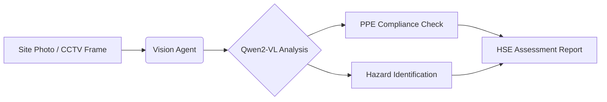

# Vision AI Safety Inspector

> **VLM for HSE Compliance at Energy Facilities**

[](https://opensource.org/licenses/MIT)
[](https://davidfernandez.dev)
[](https://huggingface.co/spaces/davidfertube/geo-insight-hse)
[](https://www.python.org/)

## Overview

**Vision AI Safety Inspector** is an experimental VLM system for HSE compliance inspection using Qwen2-VL multimodal model for safety scene understanding. This experiment explores how vision-language models can move beyond traditional object detection to understand behavioral context—recognizing not just objects, but actions and safety violations in industrial settings.

## System Architecture



## Key Features

- **Contextual VLM Reasoning**: Goes beyond bounding boxes to understand the "why" behind safety risks
- **PPE Compliance**: Automated verification of hard hats, safety vests, and other essential gear
- **Hazard Identification**: Real-time assessment of hazardous conditions and perimeter breaches
- **Expert Assessment**: Generates structured HSE reports with risk levels and mitigation actions

## Technical Stack

| Component | Technology |
|-----------|------------|
| VLM Platform | Qwen2-VL |
| Inference | Hugging Face API |
| Frontend | Gradio |
| Infrastructure | Python 3.9+, Docker |

## Quick Start

```bash
git clone https://github.com/davidfertube/geo-insight-hse.git
cd geo-insight-hse
pip install -r requirements.txt
python app.py
```

## Project Structure

```
geo-insight-hse/
├── src/
│   └── vision_agent.py  # VLM Integration & HSE Analysis
├── docs/                # Documentation
├── examples/            # Sample images
├── app.py               # Gradio Interface
├── Dockerfile           # Container config
└── requirements.txt
```

## Energy Industry Applications

- **Power Plant Safety**: Monitor personnel PPE compliance on generation floors
- **Substation Inspections**: Detect hazardous conditions in electrical switchyards
- **Construction Sites**: Verify safety protocols during facility construction

---

**David Fernandez** | Applied AI Engineer | LangGraph Core Contributor

- [Portfolio](https://davidfernandez.dev) • [LinkedIn](https://linkedin.com/in/davidfertube) • [GitHub](https://github.com/davidfertube)

MIT License © 2026 David Fernandez
